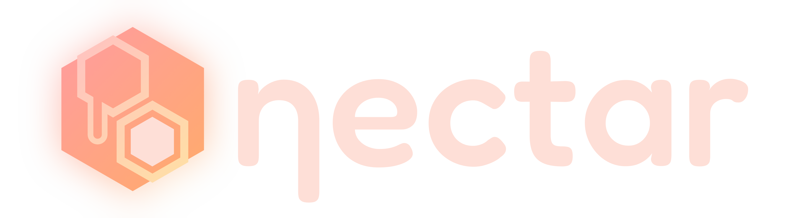

<p align="center">
   
</p>

<p align="center">
   Small, self-hostable and customizable homelab dashboard.
</p>

---

<p align="center" style="font-style: italic; font-weight: 600">"Ever dreaming to taste the sweet nectar of morality."</p>

## About the Project
Nectar is simple and small dashboard for homelabers. It's designed to be self-hosted and customized to your heart's content. This app uses very little resources and can be run totally offline.

> **THIS PROJECT IS IN BETA AND UNTESTED. USE AT YOUR OWN CAUTION.**

- 🌤️ **Weather Widget** (powered by Open-Meteo) - you can configure the location in the config file without using your actual location or any telemetry.
- 💽 **Server List** - this app relies on nothing but your configuration, you can adjust the name, hostname and the port. Server list is designed to be a simple list of your servers.
- 🥪 **Apps List** - Nectar allows you to categorize your apps by server and search your collection.

<p align="center">
   
</p>

## Installation
Before you install Nectar, you will need to have Node.js as well as NPM installed on your system. You can download Node.js from [here](https://nodejs.org/en/download/).

After you have Node, clone or download the project and extract it to a folder. Open a terminal in the folder and run the following command:

```bash
npm install
```

Once the installation is complete, you can run the app locally using the following command:

```bash
npm run dev
```

This will start the app on `http://localhost:5173`. You can access the app by opening your browser and navigating to the address.

> Currently the app is not designed to be run in production, this is built with Vite so take a look at the "Building for Production" section for more information.

**One more step!**

You will need to configure the app to your liking. You can do this by editing the `config.json` file in the root of the project. The file should be self-explanatory, but if you have any questions, feel free to open an issue.

Then create a folder called `wallpapers` inside the `public` folder and place your wallpapers in there. The app will automatically cycle through the wallpapers.

And that's it! You're all set up and ready to go.

## Roadmap
- [x] Add bookmarks panel
- [ ] Adjust config through the UI
- [ ] Wallpaper picker
- [ ] Docker support
- [ ] Demo Page

> As you know, this project is built with Vite and Vue. However I am having reservations about this tech stack, Vue is staying, however I am thinking of moving to Node.js and Express so that it can be considered a "full-stack" project. Also at the moment I am considering integrating SQLite rather than JSON so that you can edit and manage within the UI.

## License
Licensed under the Apache License, Version 2.0. Check the [LICENSE](LICENSE.md) file for more information.
